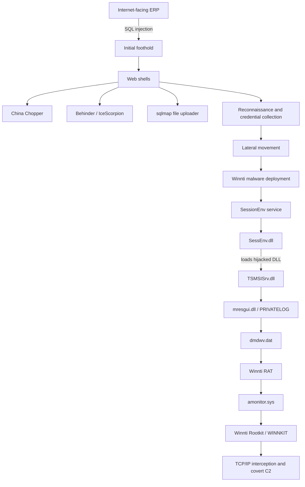

# KitsuneHook

## Overview

**KitsuneHook** is a threat-intelligence focused Hack The Box Sherlock centered on the **Winnti ecosystem** and the **RevivalStone** campaign disclosed by LAC in 2025.

Unlike the malware-analysis Sherlocks in this repository, this case does not begin with a local evidence package. The investigation is built from public threat reporting and focuses on connecting:

- threat-actor naming and vendor attribution,
- victimology and campaign context,
- initial-access tradecraft,
- web shells and post-exploitation tooling,
- the Winnti v5.0 execution chain,
- kernel-level stealth,
- related campaigns and historical continuity,
- and practical detection opportunities.

The objective of this write-up is therefore not to reproduce challenge questions, but to reconstruct the technical picture that those questions point toward.

---

## Key assessment

RevivalStone targeted Japanese organizations in the **manufacturing, materials, and energy** sectors. Public reporting attributes the campaign to the Winnti ecosystem and documents a multi-stage intrusion beginning with exploitation of an Internet-facing ERP system, followed by web-shell deployment, credential collection, lateral movement, and delivery of a modernized Winnti malware chain.

A central finding is the appearance of what LAC assesses as **Winnti v5.0**, a heavily obfuscated and layered implementation that combines:

- DLL hijacking through a legitimate Windows service,
- an encrypted DAT container,
- AES-OFB and ChaCha20,
- host-derived cryptographic material,
- an in-memory RAT,
- a temporary rootkit installer,
- and a kernel rootkit that hooks network functionality.

---

## Threat-actor naming

Threat-actor naming is one of the most important analytical pitfalls in this case.

| Source / vendor | Designation |
|---|---|
| MITRE ATT&CK | Winnti Group — **G0044** |
| MITRE ATT&CK | APT41 — **G0096** |
| Symantec | **Blackfly** / **Grayfly** activity clusters |
| Microsoft reporting | BARIUM / Brass Typhoon appear in overlapping public reporting |
| Common public reporting | Winnti / Winnti Group |

These names should **not** be treated as perfectly interchangeable.

MITRE explicitly notes that associated group names represent analytical overlap rather than guaranteed one-to-one equivalence. Its ATT&CK knowledge base maintains separate entries for **Winnti Group (G0044)** and **APT41 (G0096)**.

That distinction matters when correlating reports from different vendors.

---

## Campaign flow



---

## Technical highlights

### Initial access and web shells

LAC documented exploitation of an SQL injection flaw in an unspecified ERP platform. The compromised application was then used to deploy multiple web shells, including:

- **China Chopper**
- **Behinder** (also known as IceScorpion / Bingxia)
- a **sqlmap file uploader**

The web shells provided a practical bridge from public-facing application exploitation to internal reconnaissance, credential collection, and malware staging.

### Winnti v5.0 execution chain

The observed execution chain begins with the legitimate **Remote Desktop Configuration** service, `SessionEnv`.

`SessEnv.dll` loads a malicious `TSMSISrv.dll`, which in turn loads `mresgui.dll`. LAC identifies `mresgui.dll` as the Winnti loader, also associated with **PRIVATELOG**.

The loader reads an encrypted payload container:

```text
C:\Windows\Installer\dmdwv.dat
```

The container ultimately provides the components required to execute the RAT and deploy the rootkit.

### DAT decryption

The payload container uses layered cryptography:

```text
Host information
  ├─ IP address
  ├─ MAC address
  └─ Network-interface GUID
        │
        ▼
Key derivation
        │
        ▼
AES-OFB decryption
        │
        ▼
ChaCha20 decryption
        │
        ▼
Winnti payload components
```

The dependency on victim-specific network information makes offline payload recovery more difficult when the original host context is unavailable.

### Rootkit deployment

The RAT temporarily drops the rootkit installer as:

```text
%SystemRoot%\System32\drivers\amonitor.sys
```

The malware temporarily modifies the legitimate **AmdK8** service configuration to load the malicious driver. After deployment, the service configuration is restored.

The final Winnti rootkit operates in kernel context and is used to conceal and mediate network communications.

### Kernel interaction

The rootkit registers a dummy NDIS protocol named:

```text
IPSecMiniPort
```

It then manipulates TCP/IP-related handlers to intercept network traffic.

Communication between the user-mode RAT and kernel component makes use of Windows device objects including:

```text
\Device\Beep
\Device\Null
```

The addition and prioritization of the Beep device is one of the differences noted in the RevivalStone-era rootkit compared with earlier Winnti variants.

---

## Historical continuity

The malware chain has strong technical continuity with tooling documented during **Operation CuckooBees**, investigated by Cybereason in 2021 and published in 2022.

That earlier research described a layered Winnti arsenal including:

```text
STASHLOG
   ↓
SPARKLOG
   ↓
PRIVATELOG
   ↓
DEPLOYLOG
   ↓
WINNKIT
```

Compilation timestamps associated with `prntvpt.dll` samples from May and August 2021 align with the period investigated in Operation CuckooBees.

The continuity is important because it shows that RevivalStone is not simply a new set of disconnected malware names. Several components, deployment concepts, certificates, service-abuse techniques, and rootkit behaviors have historical precedents in earlier Winnti operations.

---

## Wider tooling ecosystem

Public reporting around the same Winnti-linked ecosystem also describes malware such as:

- **CUNNINGPIGEON** — a backdoor using Microsoft Graph API and mailbox content as a command channel.
- **WINDJAMMER** — a kernel-level component designed for covert network communication.
- **SHADOWGAZE** — a passive backdoor associated with IIS.
- **UNAPIMON** — a defensive-evasion utility.

CUNNINGPIGEON is particularly interesting from a detection perspective because malicious command traffic can be blended into legitimate Microsoft cloud API usage rather than a conventional attacker-owned C2 endpoint.

---

## TreadStone and the i-SOON leak

The 2024 **i-SOON leak** exposed internal material from the Chinese security contractor i-SOON / Anxun.

Recorded Future identified references to a Linux malware controller named **TreadStone** and linked the internal name to material associated with the Winnti malware ecosystem.

LAC later identified PDB-path strings containing both:

```text
Treadstone
StoneV5
```

in RevivalStone-related components.

LAC assessed that `StoneV5` may refer to the fifth major iteration of the Winnti malware family, supporting the **Winnti v5.0** designation used in its report.

---

## Repository contents

- [Technical analysis](./technical-analysis.md)
- [Detection engineering](./detection-engineering.md)
- [References](./references.md)

---

## Scope

This repository documents defensive research based on public threat-intelligence reporting and Hack The Box educational material.

No malware samples, exploit code, credentials, or victim data are included.
